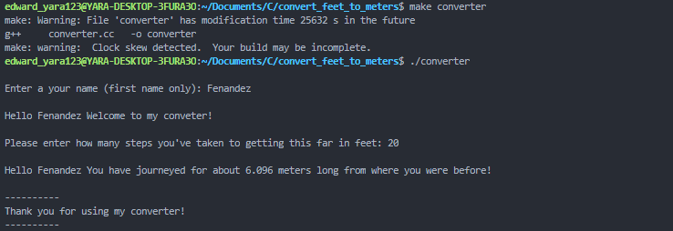

# Feet-To-Meter-Converter-C-Plus
Here in this demo I have created a feet to meter converter in C++, where a user enters his/her name and could also type in how far he has journeyed and see the result in meters, I also would congratulate him/her making it through.

# Demo


# Installation
> sudo apt-get update

> sudo apt install build-essential

# Languages Used
1. C++ Programming

# Clone Project
```
  git clone git@github.com:oluyaratosin123/Feet-To-Meter-Converter-C-Plus.git
```

```C
  cd convert_feet_to_meters
```

# Author

GitHub: [edward@github.com](https://github.com/oluyaratosin123)

Linkedin: [edward@linkedin.com](https://www.linkedin.com/in/edward-oluyara/)

Twitter: [edward@twitter.com](https://twitter.com/TOluyara)

## Contributing :handshake:
Contributions, issues, and feature requests are welcome!

## Show your support
Give a 	:star: if you like this project.

## Acknowledgments
* Hat tip to anyone whose code was used
* Inspiration
* etc
